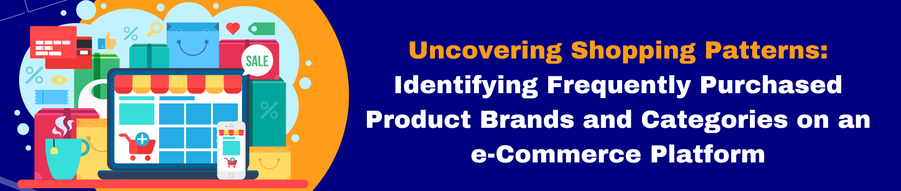

# Frequent Itemset Mining on e-Commerce Platform Data



This is a data mining project utilizing frequent itemset mining techniques to generate actionable insights for an e-commerce platform.

## Overview

In the rapidly evolving e-commerce industry, the abundance of data can be overwhelming. This study aims to help businesses harness this data for strategic decision-making and profit optimization. E-commerce has revolutionized retail by offering online buying and selling of goods and services, enabling broader reach, personalization, and convenience. To analyze consumer behavior, frequent itemset mining is utilized to uncover patterns and associations within the data, providing insights to enhance marketing, product offerings, and customer satisfaction.

## Dataset

The project uses the [E-commerce Behavior Data](https://www.kaggle.com/datasets/mkechinov/ecommerce-behavior-data-from-multi-category-store), sourced from Kaggle, covering consumer behavior over seven months. It comprises various transaction types, including purchases and carts. To streamline analysis, the team focused solely on 'purchase' transactions and grouped minor product categories into a single category called 'others' for a holistic study. Despite certain limitations, such as missing product descriptions, the dataset provides valuable insights into frequently purchased product brands and categories.

## Key Highlights

1. **E-commerce Impact:** E-commerce has reshaped retail, offering a wide range of advantages, including broader market reach and innovative business models like dropshipping and subscriptions.

3. **Data Exploration:** Data exploration played a crucial role in shaping the project's methodology. The team identified that it is more tractable and insightful to focus on the 'purchase' category. Additionally, 'electronics,' 'computers,' and 'appliances' dominated the dataset, prompting aggregation into 'others' for in-depth analysis.

4. **FIM Results:** FIM analysis, performed on major product categories, revealed frequent two-itemsets and a few three-itemsets. These insights can be leveraged for Market Basket Analysis, Inventory Management, and Personalization.

## Installation

To run this project, you can set up the required environment by installing the necessary packages using the provided `requirements.txt` file:
```bash
pip install -r requirements.txt
```

## License

This project is licensed under the MIT License - see the [LICENSE](LICENSE) file for details.